  

 

Soy **Javier Valencia**, administrador ambiental y analista de datos en Colombia. Diseño productos digitales que convierten procesos administrativos, financieros y operativos en experiencias claras, trazables y utilizables.

Mi trabajo conecta **Python, automatización documental, análisis de datos y desarrollo web**. Me interesa especialmente crear software aplicado a problemas reales: liquidaciones, pensiones, historias laborales, puntos de venta y herramientas para pequeños negocios.

## En qué estoy enfocado

- **Software administrativo y de cálculo:** flujos auditables, validaciones y exportación de resultados.
- **Datos y documentos:** procesamiento tabular, extracción desde PDF y visualización de indicadores.
- **Productos web:** interfaces responsive, dashboards y experiencias orientadas a negocio.
- **Gestión ambiental:** criterio de dominio para conectar tecnología, territorio y toma de decisiones.

## Proyectos destacados

### AppIndemnizaciones

Aplicación administrativa en **Python + Dash** para apoyar la liquidación de indemnización sustitutiva de vejez. Integra histórico IPC, extracción de certificados CETIL, normalización anual, revisión manual, cálculos trazables y exportación a Excel.

`Python` · `Dash` · `pandas` · `pdfplumber / PyMuPDF` · `openpyxl / xlsxwriter` · `pytest`

[Ver repositorio](https://github.com/Javiervalenciam/AppIndemnizaciones)

### AppPensional

Calculadora personal para el contexto pensional colombiano. El repositorio es privado; la descripción y el stack visible confirman una base principalmente en Python con una capa de estilos CSS.

`Python` · `CSS` · `Aplicación local / privada`

[Ver repositorio](https://github.com/Javiervalenciam/AppPensional)

### AppHistorias360

Producto web para auditar historias laborales y pensionales colombianas y reunir información de Colpensiones, Porvenir y Protección. El repositorio es privado; el stack visible combina Python y TypeScript.

`Python` · `TypeScript` · `CSS` · `Aplicación local / privada`

[Ver repositorio](https://github.com/Javiervalenciam/AppHistorias360)

### Sistema POS para heladería

Sistema de punto de venta orientado a la operación de una heladería. Se presenta como proyecto local; el detalle técnico no pudo verificarse públicamente, por lo que el perfil evita atribuirle tecnologías no confirmadas.

[Ver repositorio](https://github.com/Javiervalenciam/SistemaPOS-Heladeria)

### Productos web en producción

- **[JackyChina](https://www.jackychina.app/):** experiencia comercial para una cocina oculta, con menú, promociones y pedidos por WhatsApp.
- **[Finanzas JV](https://finanzas-javiervalencia.vercel.app/):** aplicación financiera con acceso seguro.
- **[Dulce Mezcla — Cupones](https://dulce-cupones.vercel.app/):** administración y validación de cupones QR para repostería.
- **[Restaurante El Gaván](https://restaurantegavan.vercel.app/):** menú llanero, pedidos por WhatsApp y experiencia editorial de marca.
- **[Dashboard NS](https://dashboardns.vercel.app/):** dashboard desplegado en Vercel; no estuvo disponible durante la revisión.

## Tech Stack

**Lenguajes**  

**Datos, documentos y visualización**  

**Entrega y colaboración**  

## GitHub Stats

  
  

  

  

Las tarjetas se generan dinámicamente. Si un proveedor está temporalmente fuera de servicio, consulta la pestaña **Activity** del perfil para ver la información directamente en GitHub.

## Contacto

- GitHub: [@Javiervalenciam](https://github.com/Javiervalenciam)
- Portafolio: [javiervalencia.pro](https://javiervalencia.pro/)
- Ubicación: Colombia

---

Algunos proyectos profesionales son privados o se ejecutan localmente. Sus descripciones se limitan a la información visible y suministrada, sin exponer datos sensibles ni atribuir tecnologías no verificadas.
